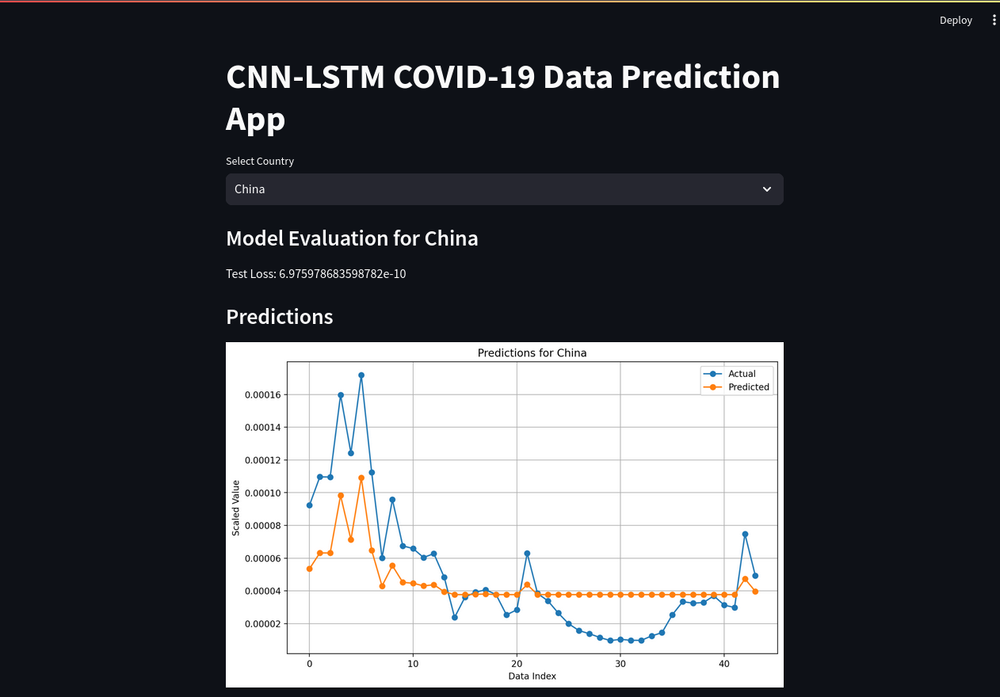

# A Hybrid of CNN_LSTM for Covid 19 prediction Data Prediction App

This Streamlit web application predicts COVID-19 data using Convolutional Neural Networks (CNN) and Long Short-Term Memory (LSTM) architecture.

## Overview

This app loads COVID-19 data from an Excel file and allows users to select a country to visualize and predict COVID-19 trends. It uses a CNN-LSTM model for prediction.

## Requirements

- Python 3.6+
- Streamlit
- Scikit-learn
- Keras
- Pandas
- Matplotlib

## Installation

1. Clone the repository:

   ```bash
   git clone https://github.com/hamidymusty/cnn_lstm.git
   ```

2. Run the Streamlit app:
    ```bash
      streamlit run streamlit.py
     ```

## Usage

    1. Upon running the app, select a country from the dropdown menu.
    2. The app will display the model evaluation metrics and predictions for the selected country.


## Dataset

The COVID-19 dataset is stored in an Excel file named COVID-19-DATA.xlsx. Make sure this file exists in the root directory before running the app.

Note
If the dataset file is not found, an error message will be displayed, prompting you to ensure that COVID-19-DATA.xlsx 
